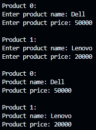

<h2>Create a class Student to store 5 student names using an array. Create a derived class Display that will show all student names using single inheritance.</h2>

<h2>Create a multilevel inheritance structure with:
- Class 1: Student – to input student name
- Class 2: Marks – to input marks of 3 subjects using array
- Class 3: Result – to calculate and display total and percentage.</h2>

<h2>Create a Product class with attributes name and price. Use a vector to store multiple 
products. Input and display all product details.</h2>

<h2>Create a base class Shape. Derive two classes:
- Circle – to calculate area of a circle
- Rectangle – to calculate area of a rectangle</h2>

<h2>Create a menu-driven program that performs the following using a vector of strings:
- Add a student name
- View all student names
- Delete student name by index</h2>

